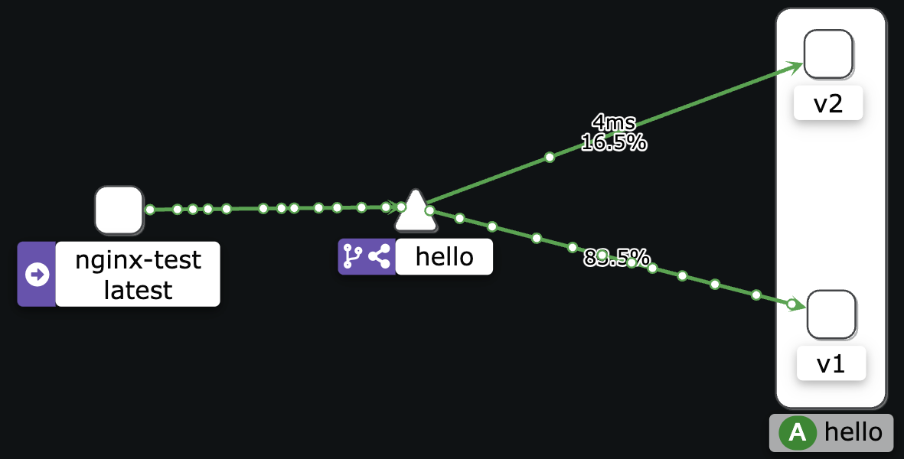

## Istio traffic shifting

### Applying the manifests

```sh
kubectl apply -f examples/http-traffic-shifting/
```

### Changing traffic weight

Edit the file `examples/http-traffic-shifting/virtual-service.yaml` and change `weight` line

```
vim examples/http-traffic-shifting/virtual-service.yaml
```

Applying changes

```sh
kubectl apply -f examples/http-traffic-shifting/virtual-service.yaml
```

### Kiali

